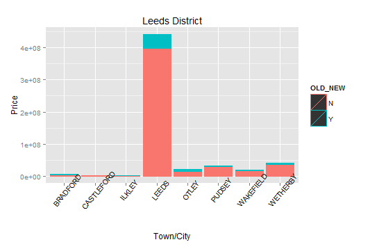
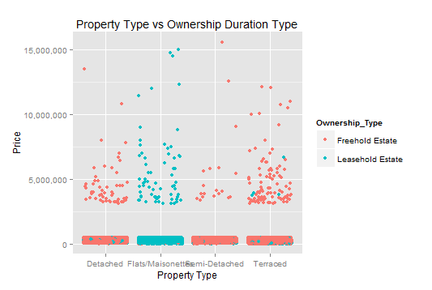
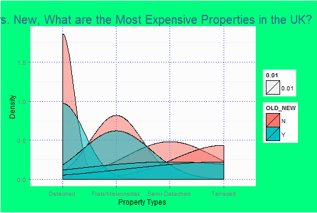

***Members:***
Raymundo Cortez
Yuyin Wang
Chigozi Yejekwe

###R_ETL
```
setwd("~/DataVisualization/DV_RProject2/01 Data")
file_path <- "pp-2015-part1.csv"
df <- read.csv(file_path, stringsAsFactors = FALSE)

# Replace "." (i.e., period) with "_" in the column names.
names(df) <- gsub("\\.+", "_", names(df))

measures <- c("Price")

# Get rid of special characters in each column.
for(n in names(df)) {
    df[n] <- data.frame(lapply(df[n], gsub, pattern="[^ -~]",replacement= ""))
}

dimensions <- setdiff(names(df), measures)
if( length(measures) > 1 || ! is.na(dimensions)) {
  for(d in dimensions) {
    # Get rid of " and ' in dimensions.
    df[d] <- data.frame(lapply(df[d], gsub, pattern="[\"']",replacement= ""))
    # Change & to and in dimensions.
    df[d] <- data.frame(lapply(df[d], gsub, pattern="&",replacement= " and "))
    # Change : to ; in dimensions.
    df[d] <- data.frame(lapply(df[d], gsub, pattern=":",replacement= ";"))
  }
}

library(lubridate)
# Fix date columns, this needs to be done by hand because | needs to be correct.
#                                                        \_/
df$Transfer_Date <- gsub(" [0-9]+:.*", "", gsub(" UTC", "", mdy(as.character(df$Transfer_Date), tz="UTC")))

# Get rid of all characters in measures except for numbers, the - sign, and period.dimensions
if( length(measures) > 1 || ! is.na(measures)) {
  for(m in measures) {
    df[m] <- data.frame(lapply(df[m], gsub, pattern="[^--.0-9]",replacement= ""))
  }
}

write.csv(df, paste(gsub(".csv", "", file_path), ".reformatted.csv", sep=""), row.names=FALSE, na = "")

tableName <- gsub(" +", "_", gsub("[^A-z, 0-9, ]", "", gsub(".csv", "", file_path)))
sql <- paste("CREATE TABLE", tableName, "(\n-- Change table_name to the table name you want.\n")
if( length(measures) > 1 || ! is.na(dimensions)) {
  for(d in dimensions) {
    sql <- paste(sql, paste(d, "varchar2(4000),\n"))
  }
}
if( length(measures) > 1 || ! is.na(measures)) {
  for(m in measures) {
    if(m != tail(measures, n=1)) sql <- paste(sql, paste(m, "number(38,4),\n"))
    else sql <- paste(sql, paste(m, "number(38,4)\n"))
  }
}
sql <- paste(sql, ");")
cat(sql)
```

###Subset and Summary
The data shows the residential property sales in England and Wales that are submitted to them for registration. The data was published in August 2014. Most column names are self explanatory save for a few. For Poperty Type; D = Detached, S = Semi-Detached, T = Terraced, F = Flats/Maisonettes. For Old_New; Y = a newly built property, N = an established residential building. For Duration; Relates to the tenure: F = Freehold, L-Leasehold. PAON stands for the Primary Addressable Object Name and SAON stands for Secondary Addressable Object Name.

```{r}
require(jsonlite)
require(RCurl)

ndf <- data.frame(fromJSON(getURL(URLencode('129.152.144.84:5001/rest/native/?query="select * from NEWPP2015PART1"'),httpheader=c(DB='jdbc:oracle:thin:@129.152.144.84:1521/PDBF15DV.usuniversi01134.oraclecloud.internal', USER='cs329e_rc37495', PASS='orcl_rc37495', MODE='native_mode', MODEL='model', returnDimensions = 'False', returnFor = 'JSON'), verbose = TRUE), ))

head(ndf)
```

ndf <- data.frame(fromJSON(getURL(URLencode('129.152.144.84:5001/rest/native/?query="select * from NEWPP2015PART1"'),httpheader=c(DB='jdbc:oracle:thin:@129.152.144.84:1521/PDBF15DV.usuniversi01134.oraclecloud.internal', USER='cs329e_rc37495', PASS='orcl_rc37495', MODE='native_mode', MODEL='model', returnDimensions = 'False', returnFor = 'JSON'), verbose = TRUE), ))


###Workflows and Graphs

1)

This workflow focuses on the the Town/City, District, Price, and Old or New columns. Any Towns that are not in the "Leeds" district are then filtered out. It is then arranged by Old/New, so that when it is visualized, they are grouped together. The graph displays all the towns in the "Leeds" district and shows the price paid in residential properties sales across all of them. The colors pink and blue represent whether the property was already established or new, respectively.

ndf %>% select(TOWN_CITY,DISTRICT,PRICE,OLD_NEW) %>% filter(DISTRICT == "LEEDS") %>% arrange(OLD_NEW) %>% ggplot(aes(x = TOWN_CITY, y = PRICE, colour = OLD_NEW)) + geom_bar(stat="identity") + labs(x = "Town/City",y = "Price",title="Leeds District") + theme(axis.text.x=element_text(angle=50,color="black"))



2)

ndf %>% mutate(cost = cume_dist(Price)) %>% filter(cost <= .90 | cost >= .999) %>% ggplot(aes(x = Property_Type, y = Price, color = Ownership_Type)) + geom_jitter(position = "jitter") + ggtitle("Property Type vs Ownership Duration Type") + xlab("Property Type") + scale_y_continuous(labels = comma)

This graph shows the relationship between types of residential property and the type and duration of ownership claim on the property registered in England and Wales from January 2015 to present. This graph also is divided between the top 0.1% of property in terms of price and the "bottom" 90%.

**In more laymen’s terms, with some loss of accuracy:** 

**Property Types:**
detached - single family homes
semi-detached - duplexes
terraced - row houses/ linked houses
flats/maisonettes - apartments

**Ownership Types:**
freehold - indeterminable ownership
leasehold - temporary ownership (leasing, basically)

**Observation 1:**
While it was fairly expected that apartments and leaseholding have such a high relationship, we thought that leaseholding would appear more frequently for semi-detached and terraced estates than single family homes, but whatever difference between the three in this regard appears immaterial.

**Observation 2:**
It also suprised us just how wide the spread of the cost in the top 0.1% of residential properties is, especially compared to the bottom 90% of residential properties. We expected an increase in spread of property price as we move up in price, but not one nearly this dramatic.



3)

df %>% group_by(Old.New) %>% select(Property.Type, Price) %>% arrange(desc(Price)) %>% filter(Price > 1000000) %>% ggplot(aes(x = Property.Type)) + geom_density(aes(fill = Old.New, alpha = .01)) + theme(panel.background = element_rect(fill = "gray99")) + theme(panel.grid.major = element_line(color = "blue", linetype = "dotted")) + theme(plot.background = element_rect(fill = "springgreen1")) + ggtitle("Old vs. New, What are the Most Expensive Properties in the UK?") + theme(plot.title = element_text(color = "steelblue4", size = 20)) + xlab("Property Types") + ylab("Density")

We wanted to edit the dataset to see which properties in England were the most expensive. In order to do this, we first seperated the data by grouping the data by property type. Then we selected for Old.New, which listed where the property was old or newly built. Finall, we filtered the dataset by only picking property values that were over 1 mil. British Pounds so that we were only looking at the most expensive properties.

The graph type is a density which depicts how many properties were valued at over a million British pounds. The data was separated by their age, the Old.New category. Finally, along the horizontal axis, lists the Property types; D = Detached, S = Semi-Detached, T = Terraced, F = Flats/Maisonettes. Finally, we ended out the graph by editting the graph labels such as increasing the plot title, etc..

In conclusion, from the graph, we can see that the most expensive properties, by far, were Old D type properties. In addition, the older properties, regardless of type, were older than the new properties.


